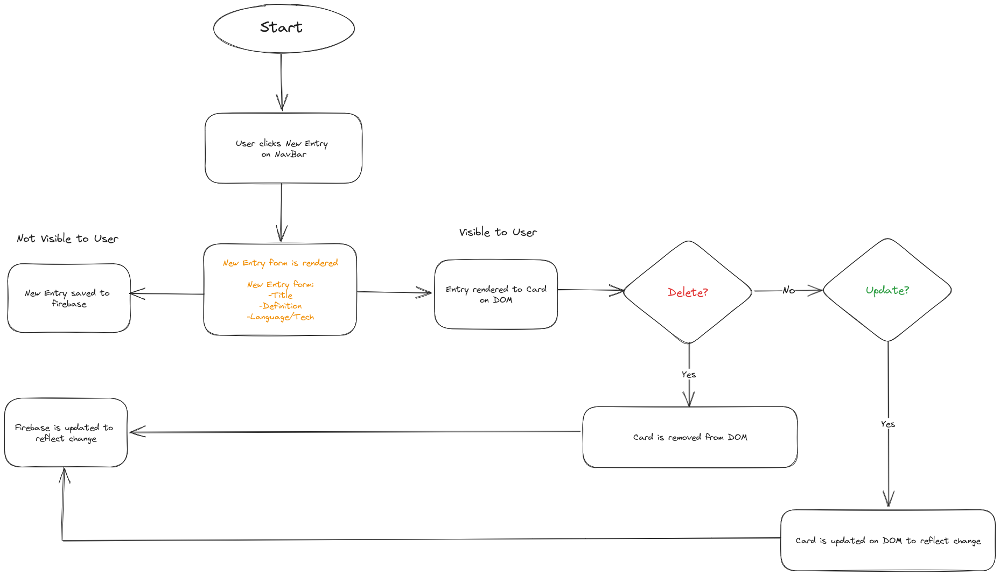
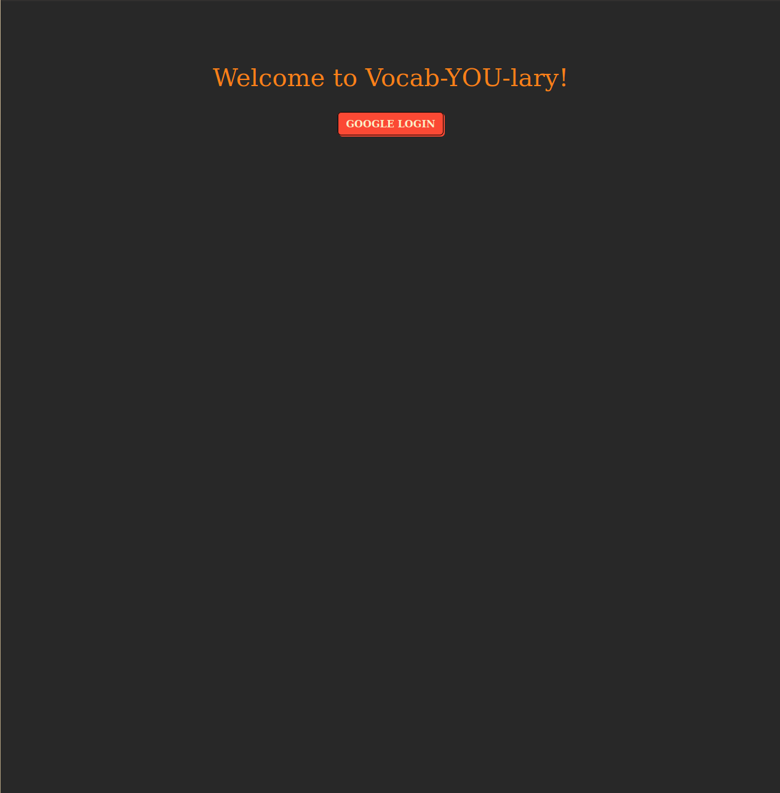
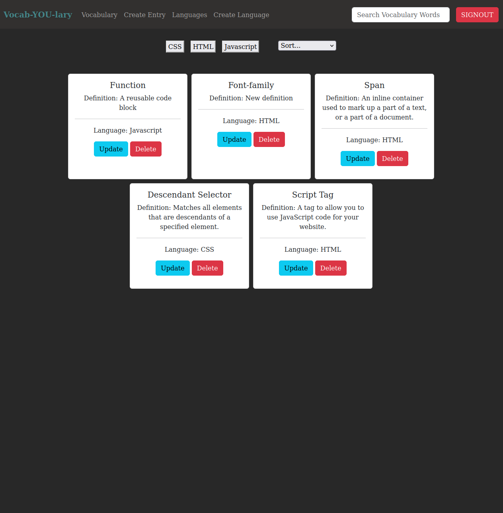
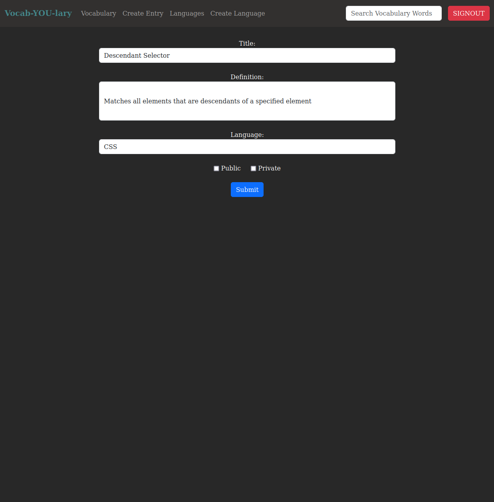
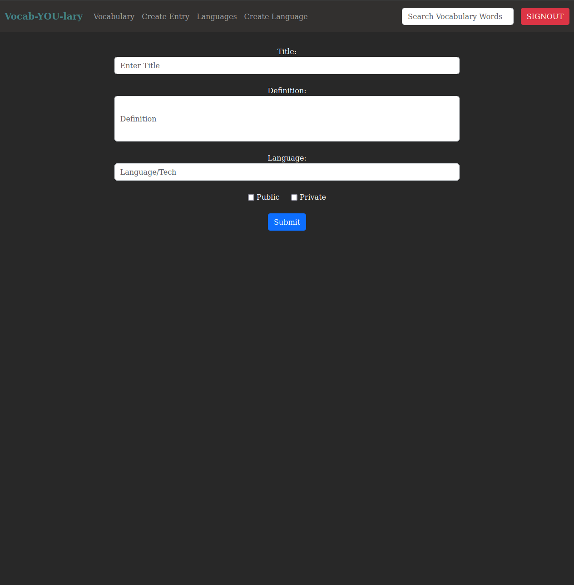
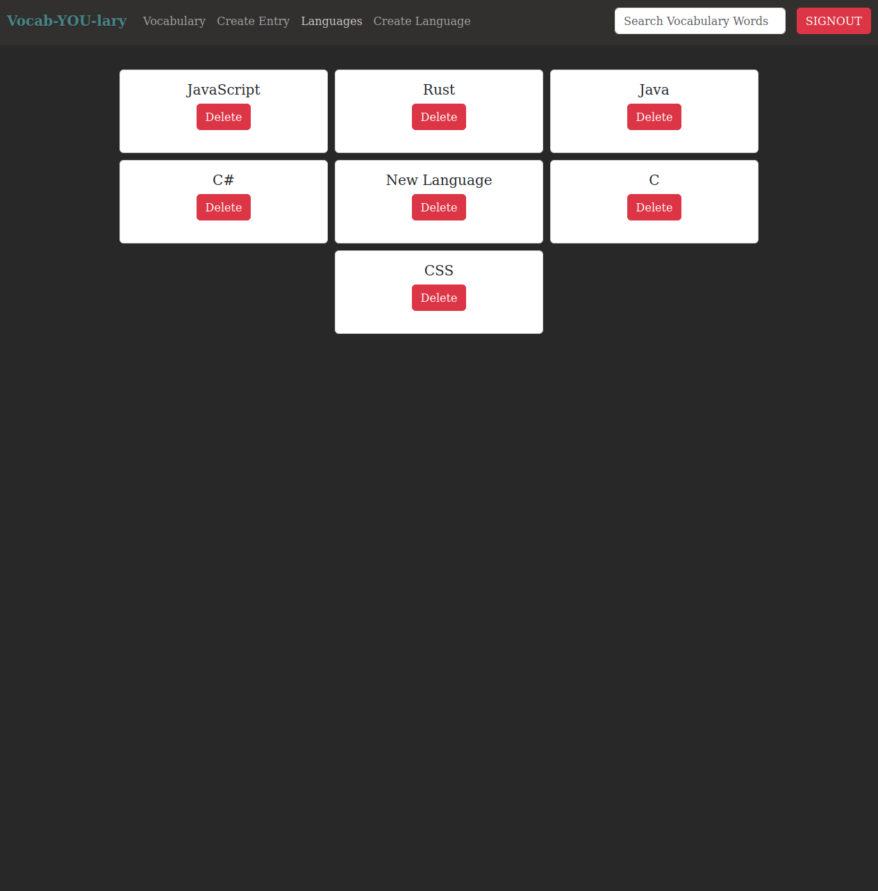
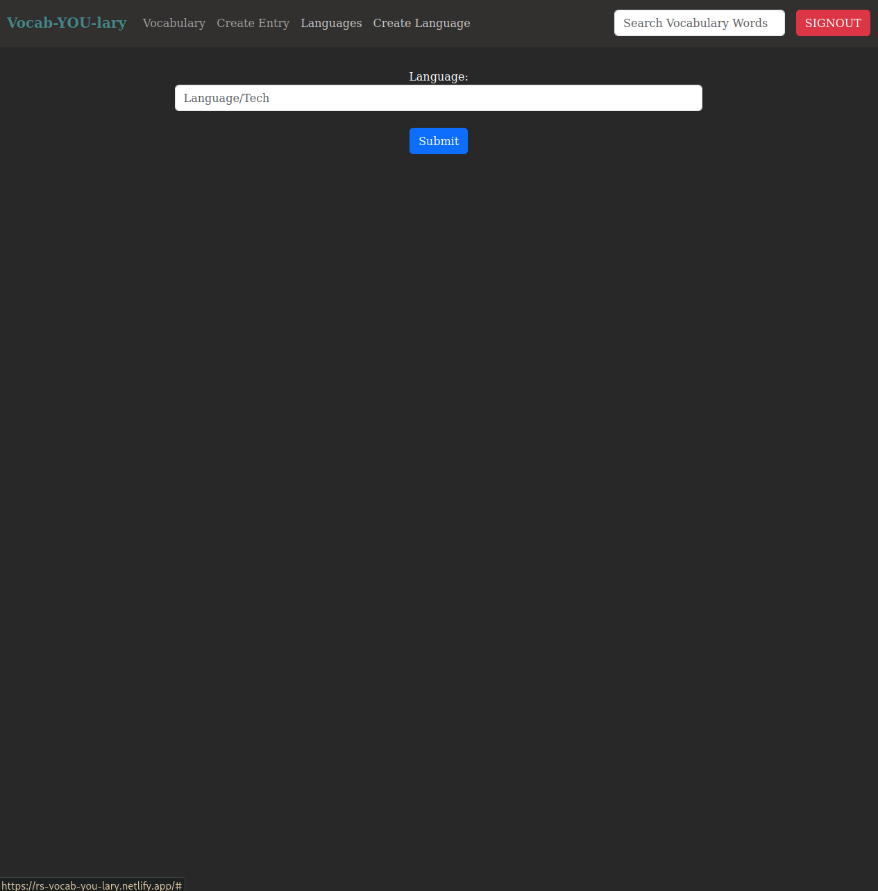

# Vocab-YOU-lary 
<!-- update the netlify badge above with your own badge that you can find at netlify under settings/general#status-badges -->

Here I am putting an overview of what my project is about.

## About the User <!-- This is a scaled down user persona -->
- The ideal user for this application is a student preparing for a test.
- The user can create, update and delete flashcards and assign a programming language to those flashcards.
- The user can sort through their flashcards based on language or search for a specific card. 
- The user can create and delete languages.

## Features <!-- List your app features using bullets! Do NOT use a paragraph. No one will read that! -->
- Upon creation card is rendered to the DOM under All Vocabulary.
- Cards can be sorted based on programming language.
- Cards can be sorted alphabetically, newest and oldest.
- Cards can be searched through with the search bar. 
- Update and delete functionality on each card.
- Creation of a language list is available.

## Video Walkthrough of APP NAME <!-- A loom link is sufficient -->

    <a href="https://www.loom.com/share/262c3d5d39cf46c7b6c407e8c3ad99b3">
      
Welcome to Vocabulary Start Page - Watch Video

    </a>
    
  

## Relevant Links <!-- Link to all the things that are required outside of the ones that have their own section -->
- [Check out the deployed site](https://main--rs-vocab-you-lary.netlify.app/)
- [Project Board](https://github.com/users/mshorecode/projects/5/views/1)

## Wireframe

## Project Screenshots <!-- These can be inside of your project. Look at the repos from class and see how the images are included in the readme -->

## Contributors
- [Ryan Shore](https://github.com/mshorecode)
